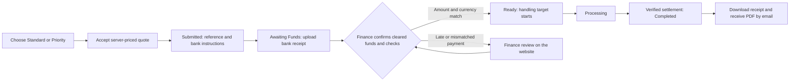

# Self-service transfer requests

The customer dashboard now takes a request from quote acceptance through funding instructions, evidence upload, status tracking and a downloadable final receipt. The main dashboard and public converter use this workflow. Finance records cleared funds and verified settlement in the admin request screen; customer communication then follows those database events automatically through Resend.

## Customer and management screens

- `/{en|fa}/dashboard`: account overview with completed transfer volume, recent activity, current indicative rate and clear attention states. This is transfer history, not a wallet balance.
- `/{en|fa}/dashboard?tab=transfer`: the transfer form offers Standard/Priority, shows the extra fee and total before acceptance, and retains converter drafts through sign-in. Legacy `tab=hub` links still work. Direction and rate changes invalidate promotional quotes; direction changes also clear the previous recipient.
- Overview, transfer, activity, profile and feedback share the same dashboard shell. Tabs survive refresh/back navigation, and individual request pages keep desktop and mobile navigation. Language switching preserves the current route and query.
- `/{en|fa}/dashboard/requests`: request history, with individual tracking pages under `/requests/<id>`.
- Each request shows its five-stage customer journey, the next owner (customer or Zarman), frozen company bank instructions, copyable reference and the explicit requirement to put that reference in the bank transfer description. PDF, PNG and JPEG bank receipts can be selected or dropped while payment awaits review, with a 4 MB application limit and private authenticated downloads.
- `/admin/requests`: queue and request settings. Staff can request information, record cleared funds against the actual receiving account, review late funds, start processing, record verified settlement or uncertain payout, and confirm refunds against a paying account. Account currencies and amounts are checked again in PostgreSQL.
- Completed requests expose an authenticated PDF download at `/api/requests/<id>/receipt`. Customers see only their own requests and public event messages. Internal bank references, staff evidence and delivery diagnostics stay restricted to management.

## Timing and payment rules

The accepted quote freezes the rate, recipient, funding total, fee and timing policy. Priority adds a distinct service fee to the amount collected; it does not reduce recipient principal or distort trade volume/rates. Prices and handling targets are configuration values, not hardcoded commercial promises.

The funding deadline asks the customer to initiate payment. A separate clearance deadline allows at least 24 hours for Australian bank clearance, configurable upwards. Uploaded evidence or a partial payment prevents blind automatic expiry and creates a finance review when clearance is overdue. Evidence never marks cash as cleared or starts the Priority clock.

The handling target starts only after finance confirms the full accepted amount in the correct currency and required checks pass. It uses the accepted Sydney business calendar, including configured holidays. Late cleared funds require an explicit decision to honour the original quote before entering the ready queue; no automatic repricing or second cash collection occurs. Iran settlement guidance identifies Paya cycles, Satna operating hours and holidays without promising fixed cycle times. The handling target is distinct from recipient bank arrival.

Uncertain payout remains in reconciliation and cannot be retried or cancelled as if no payout occurred. Cancellation after collection creates recorded refund obligations. Priority collections/refunds create immutable cash adjustments; priority income is recognized only on successful completion when the fee is retained. Treasury and daily/customer/monthly/yearly reports include this income separately from exchange principal and volume.

This integration retains the existing principal accounting convention: trade principal is booked on verified settlement. The legacy asset-value metric uses trade inventory and IRT liquidity, so it is not a complete valuation of nontrade AUD cash or customer-money liabilities. Finance should use the request payment/refund journal and account statements for those reconciliations.

## Database and email implementation

Request commands run as server-authorized PostgreSQL transactions, with version checks and idempotency keys. The same transaction records state, audit events and notification jobs. Immutable quote/payment evidence and guards on linked legacy transaction/ledger writes prevent old dashboard paths from bypassing the request state machine. The former direct submission action asks stale clients to refresh and accept a current quote.

The durable notification worker retries with the exact saved message, attachment and Resend idempotency key. Verified webhooks reconcile acceptance, delivery and failure. Completion freezes a receipt snapshot from the accepted quote and verified settlement. Read [notification setup](request-notification-setup.md) for environment variables, scheduling, webhooks and failure handling.

## Release sequence

1. Apply the repository's pending migrations in order. The request feature requires `20260911_18_customer_requests.sql`, `_19_request_notifications.sql`, then `20260913_23_request_funding_and_receipts.sql`, `_24_request_receipt_notifications.sql`, `_25_request_fee_accounting.sql`, and `_26_request_fee_ledger_type.sql`, along with their existing core/accounting prerequisites. `_18` contains syntax corrections needed for fresh installations. `_24` replaces the earlier notification RPC definitions. `_25` requires the reporting schema and standardized trade-fee accounting from `_09`, `_10` and `_13`. `_26` adapts the legacy ledger type check to permit only the managed priority-fee adjustment created by `_25`; ordinary non-fee transfer rows remain prohibited. Apply `_26` before enabling paid priority, or reconciled funding will roll back when it attempts to post the surcharge.
2. Deploy the application and included PDF font assets. Configure the existing Supabase/Resend credentials plus the request sender, canonical HTTPS origin, webhook secret and authenticated worker secret. Configure the external/header-capable scheduler and Resend webhook as described in [notification setup](request-notification-setup.md).
3. In `/admin/requests`, enter finance-approved AUD and IRT funding instructions, management email recipients, Standard/Priority targets, extra fee, capacity, translated Priority terms, Sydney working hours/holidays and current Iran banking guidance. Default request and Priority flags are disabled. The activation action validates required configuration before saving an enabled setting.
4. Verify the deployed flow with approved staging recipients and synthetic request/payment records, then enable the desired tiers. Exercise both currency directions, evidence upload, delayed funds, completion and refunds; confirm actual provider delivery and final PDF retrieval.

The recipient directory additionally requires `20260920_32_recipient_bank_city.sql` before deploying the current dashboard. It adds the optional Iranian bank branch city without changing the residential city field.

No production migrations, bank operations, real emails or live scheduler were run as part of this repository implementation. Existing pending legacy transactions remain historical records; they are not silently converted into accepted online requests. If earlier request migrations already produced data, review legacy notification jobs without immutable snapshots before activating the worker, as described in the notification setup guide.

## Verification

`npm run test:requests` uses ephemeral PostgreSQL (PGlite), actual migrations and isolated frontend/server/email doubles. It covers pricing in both directions, permissions, idempotency, delayed funds and banking calendars, evidence storage rules, settlement/refund atomicity, accounting and reports, customer/admin controls, mail ordering/retries/webhooks, and deterministic Persian-capable PDF receipts. It does not connect to live Supabase or send email.

Also run `npm run test:converter`, `npm run test:bank-fees`, TypeScript checking and the production build for the surrounding converter/accounting integration. Real bank clearance, provider delivery and deployed scheduler configuration require the staging checks above.

Verified locally on 2026-09-13: all 50 request workflow tests, 106 converter assertions, 16 bank-fee tests and 13 surrounding admin/treasury tests passed. TypeScript and the optimized Next.js production build passed. The request-specific ESLint checks passed; the older email/treasury action files still contain pre-existing explicit-`any` lint errors outside this change.
