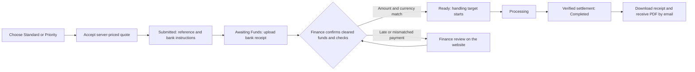

# Self-service transfer requests

The customer dashboard now takes a request from quote acceptance through funding instructions, evidence upload, status tracking and a downloadable final receipt. The main dashboard and public converter use this workflow. Finance records cleared funds and verified settlement in the admin request screen; customer communication then follows those database events automatically through Resend.

```mermaid
flowchart LR
  A[Choose Standard or Priority] --> B[Accept server-priced quote]
  B --> C[Submitted: reference and bank instructions]
  C --> D[Awaiting Funds: upload bank receipt]
  D --> E{Finance confirms cleared funds and checks}
  E -->|Amount and currency match| F[Ready: handling target starts]
  E -->|Late or mismatched payment| G[Finance review on the website]
  G --> E
  F --> H[Processing]
  H --> I[Verified settlement: Completed]
  I --> J[Download receipt and receive PDF by email]
```

## Customer and management screens

- `/{en|fa}/dashboard`: account overview with completed transfer volume, recent activity, current indicative rate and clear attention states. This is transfer history, not a wallet balance.
- `/{en|fa}/dashboard?tab=transfer`: the transfer form offers Standard/Priority, shows the extra fee and total before acceptance, and retains converter drafts through sign-in. Legacy `tab=hub` links still work. Direction and rate changes invalidate promotional quotes; direction changes also clear the previous recipient.
- Overview, transfer, activity, profile and feedback share the same dashboard shell. Tabs survive refresh/back navigation, and individual request pages keep desktop and mobile navigation. Language switching preserves the current route and query.
- `/{en|fa}/dashboard/requests`: request history, with individual tracking pages under `/requests/<id>`.
- Each request shows its five-stage customer journey, the next owner (customer or Zarman), frozen company bank instructions, copyable reference and the explicit requirement to put that reference in the bank transfer description. PDF, PNG and JPEG bank receipts can be selected or dropped while payment awaits review, with a 4 MB application limit and private authenticated downloads.
- `/admin/requests`: queue and request settings. Staff can request information, record cleared funds against the actual receiving account, review late funds, start processing, record verified settlement or uncertain payout, and confirm refunds against a paying account. Account currencies and amounts are checked again in PostgreSQL.
- Completed requests expose an authenticated PDF download at `/api/requests/<id>/receipt`. Customers see only their own requests and public event messages. Internal bank references, staff evidence and delivery diagnostics stay restricted to management.

## Timing and payment rules

The accepted quote freezes the rate, recipient, funding total, fee and timing policy. Priority adds a distinct service fee to the amount collected; it does not reduce recipient principal or distort trade volume/rates. Prices and handling targets are configuration values, not hardcoded commercial promises.

The funding deadline asks the customer to initiate payment. A separate clearance deadline allows at least 24 hours for Australian bank clearance, configurable upwards. Uploaded evidence or a partial payment prevents blind automatic expiry and creates a finance review when clearance is overdue. Evidence never marks cash as cleared or starts the Priority clock.

The handling target starts only after finance confirms the full accepted amount in the correct currency and required checks pass. It uses the accepted Sydney business calendar, including configured holidays. Late cleared funds require an explicit decision to honour the original quote before entering the ready queue; no automatic repricing or second cash collection occurs. Iran settlement guidance identifies Paya cycles, Satna operating hours and holidays without promising fixed cycle times. The handling target is distinct from recipient bank arrival.

Uncertain payout remains in reconciliation and cannot be retried or cancelled as if no payout occurred. Cancellation after collection creates recorded refund obligations. Priority collections/refunds create immutable cash adjustments; priority income is recognized only on successful completion when the fee is retained. Treasury and daily/customer/monthly/yearly reports include this income separately from exchange principal and volume.

This integration retains the existing principal accounting convention: trade principal is booked on verified settlement. The legacy asset-value metric uses trade inventory and IRT liquidity, so it is not a complete valuation of nontrade AUD cash or customer-money liabilities. Finance should use the request payment/refund journal and account statements for those reconciliations.

## Database and email implementation

Request commands run as server-authorized PostgreSQL transactions, with version checks and idempotency keys. The same transaction records state, audit events and notification jobs. Immutable quote/payment evidence and guards on linked legacy transaction/ledger writes prevent old dashboard paths from bypassing the request state machine. The former direct submission action asks stale clients to refresh and accept a current quote.

The durable notification worker retries with the exact saved message, attachment and Resend idempotency key. Verified webhooks reconcile acceptance, delivery and failure. Completion freezes a receipt snapshot from the accepted quote and verified settlement. Read [notification setup](request-notification-setup.md) for environment variables, scheduling, webhooks and failure handling.

## Release sequence

1. Apply the repository's pending migrations in order. The request feature requires `20260911_18_customer_requests.sql`, `_19_request_notifications.sql`, then `20260913_23_request_funding_and_receipts.sql`, `_24_request_receipt_notifications.sql`, `_25_request_fee_accounting.sql`, and `_26_request_fee_ledger_type.sql`, along with their existing core/accounting prerequisites. `_18` contains syntax corrections needed for fresh installations. `_24` replaces the earlier notification RPC definitions. `_25` requires the reporting schema and standardized trade-fee accounting from `_09`, `_10` and `_13`. `_26` adapts the legacy ledger type check to permit only the managed priority-fee adjustment created by `_25`; ordinary non-fee transfer rows remain prohibited. Apply `_26` before enabling paid priority, or reconciled funding will roll back when it attempts to post the surcharge.
2. Deploy the application and included PDF font assets. Configure the existing Supabase/Resend credentials plus the request sender, canonical HTTPS origin, webhook secret and authenticated worker secret. Configure the external/header-capable scheduler and Resend webhook as described in [notification setup](request-notification-setup.md).
3. In `/admin/requests`, enter finance-approved AUD and IRT funding instructions, management email recipients, Standard/Priority targets, extra fee, capacity, translated Priority terms, Sydney working hours/holidays and current Iran banking guidance. Default request and Priority flags are disabled. The activation action validates required configuration before saving an enabled setting.
4. Verify the deployed flow with approved staging recipients and synthetic request/payment records, then enable the desired tiers. Exercise both currency directions, evidence upload, delayed funds, completion and refunds; confirm actual provider delivery and final PDF retrieval.

The recipient directory additionally requires `20260920_32_recipient_bank_city.sql` before deploying the current dashboard. It adds the optional Iranian bank branch city without changing the residential city field.

No production migrations, bank operations, real emails or live scheduler were run as part of this repository implementation. Existing pending legacy transactions remain historical records; they are not silently converted into accepted online requests. If earlier request migrations already produced data, review legacy notification jobs without immutable snapshots before activating the worker, as described in the notification setup guide.

## Verification

### Administrator final amounts (2026-10-09)

The current second step uses the original **Verify incoming payment** layout and **Confirm funds received** button, with independent received/recipient amount fields and visible accounting rate/fee inputs. The upper amount summary is read only. Apply `20261009_56_repair_final_amount_confirmation.APPLY_MANUALLY.sql` after 52–54 before deploying this application; it installs the finalizer and its required columns even when optional migration 51 was omitted. Installing it does not edit existing request amounts or confirm any payment.

The reported unchanged-payment failure came from migration 55 being present without the `original_quote` and `pricing_pending_acceptance` columns. PostgreSQL accepted the procedure definition but raised `42703` at execution. Migration 56 repairs this dependency and allows legacy pending-price requests to be finalized directly by the administrator. The deployment checker now verifies both columns as well as the RPC and payment views.

The administrator enters the final customer payment and recipient amount independently, chooses the credited account and confirms once. Either amount may increase or decrease. For example, 639,090,000 IRT can become 637,000,000 IRT while the recipient amount stays unchanged. No comparison against the old funding total, correction-reason field, finance-team stage or second customer approval is required for this finalization.

`finalize_exchange_request_funds` replaces the request amounts, pending transaction and effective received total in one transaction, then releases the request directly to settlement. Existing deposits are revised into one final total rather than added again; original rows, original quote and audit remain available. The summary, destination amount, accounting ledger and final invoice use the saved final amounts. The effective quote rate is calculated from the final amounts and original quote fees; separately editable accounting rate/fee remain explicit accounting terms. Currency precision, authorization, version/retry checks and protections for settled/refunded/posted amounts remain enforced.

Focused `final amounts:` cases in the pricing DB, action and interface scripts cover the missing-column reproduction and repair, unchanged 769,668,900 IRT / 4,235 AUD confirmation, zero/nonzero fee and rate-only changes, increases/decreases in both directions, Persian input, independent amount fields, replacement of existing deposits, a single confirmation, rollback and final invoice/ledger amounts. No live deposit, email or payout is used by these checks.

### Correct recorded deposits (2026-10-09)

This is the earlier correction RPC retained for historical compatibility. The current admin form uses migration 56 and final-amount replacement instead.

Apply `20261009_54_correct_recorded_request_funds.APPLY_MANUALLY.sql` after the existing workflow and migrations 51–53, before deploying this application. It adds a service-only correction RPC and payment read views. Installing it does not change any historical deposit or automatically choose which entry is a duplicate.

The admin **Correct recorded deposits** form edits an existing amount or excludes a duplicate from the total. One confirmation saves the corrections and releases an exactly funded request directly for settlement; there is no additional funding confirmation. For the reported case, keep the 726,960,000 IRT entry and exclude the mistaken 726,965,000 IRT entry after the administrator verifies the bank record. Never record another deposit to repair either entry.

Original payment rows remain intact. Append-only revisions, the internal event and audit store the reason and actor. All workflow payment sums, currency/account checks, settlement and refunds read the effective amounts. Corrections use the workflow locks, expected version and command key; retries cannot add another deposit or collect another fee. Execution, refund and posted fee records prevent changing already-accounted payments. Existing identity/settlement safeguards remain in place.

The unpaid-only payment approval command is hidden once a deposit exists. Overpayments instead open the correction form. Partial corrections retain only the outstanding balance; exactly funded corrections immediately show destination settlement. The form accepts Persian, Arabic and English digits and preserves whole-Toman precision.

### Atomic funding accounting terms (2026-10-09)

Apply `20261009_52_atomic_request_accounting_terms.APPLY_MANUALLY.sql` after the existing request workflow migrations, **before deploying the application change**. It includes the idempotent `_43_request_accounting_overrides` schema setup in case that manual migration was missed, and adds the service-only `confirm_exchange_request_funds` RPC. If the new RPC is absent, the application fails before recording funds; it does not fall back to the former two-step write.

The previous action recorded the payment, then saved accounting terms in separate direct updates. A missing `_43` column or a retained `guard_exchange_request_transaction` guard makes those updates fail after funds have committed (`_35` removes that guard in newer deployments). The new RPC commits the payment, accounting overrides, linked transaction, audit and retry result together under the existing workflow locks and any retained guards. Zero is a valid fee. The accepted quote and customer/recipient amounts remain unchanged; settlement uses the saved accounting rate/fee. Partial deposits retain saved terms unless explicitly edited.

This migration makes no historical data changes. For a request that already displayed “Funds were recorded, but the adjusted rate or fee could not be saved”, refresh and inspect its recorded payments and accounting terms before any further action. The old path may have saved the request override before the transaction update failed. Do not confirm the same deposit again to repair accounting; reconcile the affected record separately.

If that exact message still appears, the running server action is the old two-step implementation: the updated application no longer contains that error. Apply migration `_52` to the database used by the deployment, then publish/restart the updated application and refresh the admin page. Updating the repository alone does not update either the hosted database or the deployed application.

Run `node scripts/check-request-accounting-deployment.mjs` with the target deployment's environment to check whether the database API exposes the atomic funding function and accounting override column. This check is read-only and prints no credentials or customer records. Missing API objects now produce an explicit administrator error naming migration `_52`; the action never falls back to the old write path. The diagnostic only checks API readiness, not the deployed application version or a real payment.

`scripts/test-request-pricing-db.mjs` covers fee changes 0→10 and 10→0 in both currencies, settlement, exact retries and conflicts, rollback of a simulated accounting failure, input validation, grants and partial deposits. Action/UI tests cover sending an explicit zero, displaying saved terms and refusing a fallback when the migration is missing.

`npm run test:requests` uses ephemeral PostgreSQL (PGlite), actual migrations and isolated frontend/server/email doubles. It covers pricing in both directions, permissions, idempotency, delayed funds and banking calendars, evidence storage rules, settlement/refund atomicity, accounting and reports, customer/admin controls, mail ordering/retries/webhooks, and deterministic Persian-capable PDF receipts. It does not connect to live Supabase or send email.

Also run `npm run test:converter`, `npm run test:bank-fees`, TypeScript checking and the production build for the surrounding converter/accounting integration. Real bank clearance, provider delivery and deployed scheduler configuration require the staging checks above.

Verified locally on 2026-09-13: all 50 request workflow tests, 106 converter assertions, 16 bank-fee tests and 13 surrounding admin/treasury tests passed. TypeScript and the optimized Next.js production build passed. The request-specific ESLint checks passed; the older email/treasury action files still contain pre-existing explicit-`any` lint errors outside this change.
