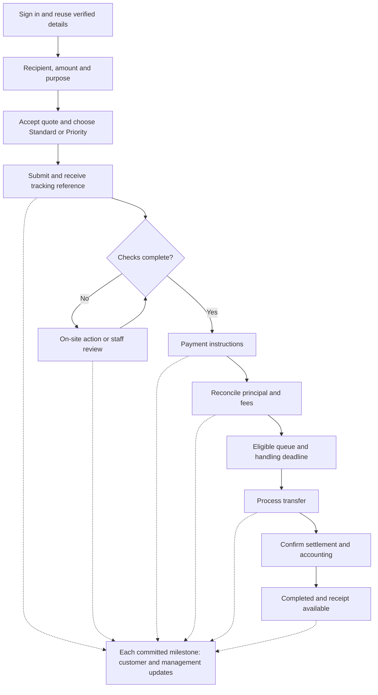
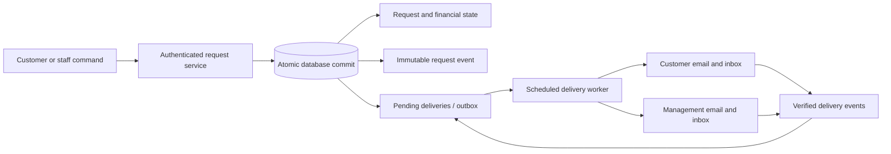

# Automated customer requests for Zarman Exchange

Design prepared 11 September 2026. Status: proposed architecture; no production changes, payments, or messages have been made.

The recommended workflow extends the existing customer dashboard into a complete request and tracking service. Customers enter transfer details once, accept an itemised quote, choose standard or paid priority handling, and receive a reference and progress updates. Staff work from a shared queue with ownership, deadlines, and exceptions. WhatsApp remains available for support.

This design is grounded in the local working copy of `pezhmanmahmoudi/zarman-website`, branch `redesign-v1`, based on commit `393062e`, including pre-existing uncommitted changes. GitHub access confirmed that repository. Production database structure, deployed configuration, payment-provider capabilities, staffing capacity, and delivery credentials have not been verified. Commercial examples below are proposals, not current prices or promises.

## Existing capabilities and integration points

| Capability | Evidence in the current checkout | Design implication |
|---|---|---|
| Transfer form with amount, direction, saved recipients, purpose, source of funds and education payment links | `components/dashboard/DashboardRequestHub.tsx`, particularly `submit()` around line 340 | Reuse the form and recipient selection. Replace the WhatsApp handoff with an on-site confirmation and request detail page. |
| Authenticated server submission already creates a pending transaction | `app/actions/transaction.actions.ts:48`, insertion around line 203 | Build a transactional submission service; return the request ID, reference, status and accepted quote. |
| Customer history | `components/dashboard/DashboardTransactionHistory.tsx:121`; `app/[locale]/dashboard/dashboard.types.ts:35` | Replace coarse status labels for new requests with a timestamped timeline and explicit next action. |
| Identity checks and an alternate identity path | `components/dashboard/DashboardProfile.tsx:260`, `:273`; `app/actions/kyc.actions.ts` | Retain verification. Give customers with alternative identity documents an on-site manual-review task instead of a mandatory WhatsApp detour. |
| Existing financial approval | `app/actions/admin.actions.ts:622`, ledger insertion around line 729 | Approval posts accounting entries. Keep financial state separate from customer workflow state. |
| Customer receipt email through Resend | `app/actions/email.actions.ts:106`, `emails/TransactionReceiptEmail.tsx`, `emails/TransactionReceiptPdf.ts` | Reuse branding and email integration; move automatic updates and completion receipts to reliable background delivery. |
| Management Telegram notification for KYC | `app/actions/kyc.actions.ts:166` | An optional management alert adapter can reuse this pattern, after delivery configuration is verified. |
| Direction-sensitive exchange fees and loyalty pricing | `lib/pricing.ts`, `lib/finance-config.ts` | Preserve established principal and base-fee semantics; account for the priority surcharge separately. |
| WhatsApp text and entry points | `lib/i18n/index.ts:103`, `:219`; `components/sections/RateSection/ConverterFa.tsx:100`; `lib/constants/contact.ts` | Change the primary transfer action to “Submit request”; retain a clearly labelled support action. |

The checked-in migrations are incremental; a complete baseline schema, policies and triggers are absent. Inspect those definitions in staging before writing migrations, especially transaction ID types, uniqueness, deletion cascades and financial triggers. Source inspection alone cannot establish the production database's behaviour.

## Customer journey

1. **Start a request.** The public converter offers “Continue with this quote”. Sign-in returns to the saved draft. Preserve direction and amount, but obtain a fresh authoritative quote after sign-in. Save drafts against the authenticated account; do not put bank or identity data in URLs or browser storage.
2. **Confirm customer and recipient details.** Prefill the verified profile and selected recipient. Ask only for missing or transaction-specific information. Validate bank fields for the chosen corridor. For education payments, collect institution, beneficiary and invoice/reference details alongside a validated payment URL. Source of funds and purpose must be confirmed for every request.
3. **Choose service.** Default to Standard. Display the incremental priority fee, processing target, operating calendar, capacity availability and refund terms beside the Priority option. Show the expected start time outside business hours.
4. **Review and accept.** Show “You send”, “Recipient receives”, exchange rate, existing transfer fee, priority fee, total payable, expiry, recipient summary and delivery estimate. Clearly distinguish AUD, Toman and rial; never silently interchange them. Record the quote version and terms acceptance. Requote with explicit acceptance if any amount changes.
5. **Submit on the site.** Validate and save atomically. Display a reference, status, timeline, next action and secure tracking link. Retrying the same submission returns the same request. The customer never needs to open a chat to complete submission.
6. **Review and funding.** Automated checks route complete, eligible requests to payment instructions. Exceptions go to the operations team. If more information is needed, show a specific task and secure upload form. Payment instructions show the approved destination account, exact currency/amount and unique reference. An uploaded receipt means “Payment evidence received”; only reconciliation can mark funds confirmed.
7. **Process and track.** Once cleared funds, required fees, current verification, accepted quote and service capacity are confirmed, the request enters the eligible work queue. Customers see the responsible team, progress and next expected update. A request-linked conversation retains context when staff need clarification.
8. **Complete.** Mark completed only after payout/settlement evidence and the associated accounting operation succeed. Send the receipt and make it downloadable. “Repeat transfer” starts a new draft with reusable details and a new quote.

English and Persian must cover the entire journey, emails, errors and timelines, with right-to-left layout where appropriate. Forms need keyboard operation, clear field errors, mobile layouts and preserved inputs after recoverable failures.

## Priority service and commercial rules

Sell priority **handling**, with a measurable obligation: a qualified operator must complete the readiness review and begin the execution step within the published target. Assignment alone does not fulfil that obligation. Bank settlement timing is a separate estimate and may depend on external processing.

| Setting | Standard | Priority |
|---|---|---|
| Additional service fee | AUD 0 | Configurable fixed fee; AUD 25 is an illustrative starting point only |
| Handling target | Example: 4 business hours after readiness | Example: 30 business minutes after readiness |
| Admission | Normal eligible queue | Capacity-limited reservation accepted with the quote |
| Ordering | Due date and age | Earlier deadline, subject to standard-service deadlines and an anti-starvation rule |
| Identity and funds checks | Required | Required |

Management must set the actual fee, applicable tax treatment, operating hours, holiday calendar, funding deadline, handling targets, capacity and refund policy before enabling sales. Store UTC timestamps and a versioned `Australia/Sydney` operating calendar, including daylight-saving handling. The examples are test fixtures for the design, not commitments to customers.

**Fee collection.** Collect the surcharge with the incoming transfer in the first release, using the existing bank-transfer process. For incoming AUD, it is an additional AUD line item. For incoming Toman, convert the configured AUD fee using the accepted quote's explicit fee conversion rate and round to whole Toman. Persist both the denomination and actual collection currency/amount. Do not reduce the advertised recipient amount or modify the exchange rate to hide this charge. Show the exchange subtotal calculated by the existing pricing rules, then the separate priority amount and final funding total. Existing promotional-rate benefits do not discount priority unless a versioned policy explicitly says so.

For illustration, an exchange subtotal of AUD 1,000 plus an AUD 25 priority charge produces an AUD 1,025 funding instruction. This is an arbitrary quote example, not a live calculation of Zarman's existing fees.

**Readiness and capacity.** `requested_tier=priority` does not establish payment. Reserve bounded capacity for a defined funding window using a locked capacity record. A customer becomes priority-eligible only when funds and the fee are confirmed and all execution prerequisites are satisfied. Set `ready_at` and `handling_due_at` atomically. Expire unpaid reservations. Recheck capacity for late funding or prolonged pre-readiness review; if the original service can no longer be supplied, offer a new explicitly accepted window or standard service with the priority fee returned. Bound active reservations per customer and account for pre-readiness reservations in admission control.

**Queue policy.** Use earliest due date among eligible work, with age as a tie-breaker and a maximum wait for standard requests. New priority sales must close before they make existing commitments infeasible. Only qualified staff can claim a request; claiming is atomic. A configurable pre-deadline alert escalates unclaimed or stalled work to the duty manager.

**Clock and refund rules.** Start the handling clock only at readiness. A later customer action or external compliance hold may pause it only under the terms accepted by the customer, with a reason, timestamps and a visible revised expectation. Internal staffing delays do not pause it. A confirmed handling-target breach automatically creates a priority-fee refund obligation and alerts both parties. The worker initiates a refund only through a verified supported rail; for bank transfers in the first release, finance fulfils the refund task and attaches confirmation. Display “Refund pending” until actual return is reconciled. Refund in the original collection currency/amount. Track principal refunds separately.

Proposed cancellation terms: cancel before processing and return any collected priority fee; reject an unserviceable request and return the priority fee; after the promised handling step has been delivered, cancellation does not automatically imply a fee refund. Management must finalise these terms and exception authority before launch. Once payout is committed, cancellation becomes a staff-reviewed recall/refund request, never a database deletion.

## State and authority model

Use a new `exchange_requests` aggregate linked one-to-one to the existing `transactions` record. Preserve existing financial meanings. Customer progress is `workflow_status`; money receipt is `funding_status`; priority fee collection/refund has its own state. Do not label an accounting approval “Completed” without payout evidence.

| Workflow status | Entry condition and authority | Next permitted actions |
|---|---|---|
| `submitted` | Authenticated customer accepts a valid server quote; atomic creation | System moves to review or funding; customer may cancel if no payout is committed |
| `under_review` | Staff/compliance review required | Authorised reviewer requests information, rejects, or releases to funding |
| `action_required` | A typed task identifies missing evidence, payment discrepancy or requote | Customer supplies information; server/reviewer revalidates and returns to the recorded permitted state |
| `awaiting_funds` | Required pre-funding review passed; valid payment instructions issued | Reconciliation records partial/cleared funds; unresolved discrepancies require action |
| `ready` | Funds and fees cleared; required checks current; quote and capacity valid | Qualified staff atomically claim and begin processing |
| `processing` | Readiness review and execution step started with an audit event | Record payout evidence and complete; failures move to action/review without repeating payout |
| `completed` | Settlement confirmed and accounting committed | Read-only outcome; corrections require audited reversal/refund operations |
| `cancelled`, `rejected`, `expired` | Guarded terminal outcome, with reason | Resolve any separately recorded refund obligation; do not erase the request |

An expired quote before submission creates no payable request. An expired funding window can expire an unpaid request and release capacity. Money arriving later must still be matched and handled through a funded-exception/refund task; never discard it or automatically book an expired quote. Part-paid or funded requests require financial disposition before closure. Public reasons must not expose internal compliance notes.

Every transition requires an expected version, allowed source state, actor permissions and transition-specific evidence. Log actor, timestamp, prior/next state, reason and correlation ID. Lock the request and relevant accounting/capacity rows inside one database transaction. Persist status changes, audit events, fee obligations and notification jobs together. Repeated commands must return the original result; conflicting commands return a conflict and reload the current record.

Before any external payout, persist and claim a durable execution intent with a unique attempt/reference. An external bank transfer cannot participate in the local database transaction. If a payout may have succeeded but its confirmation is lost, enter a reconciliation hold and prohibit blind retries, cancellation or release of the same funds. Where a verified provider supports idempotency, retries reuse the same operation key. In the first release, manual bank payouts require a claimed execution task and a finance check of the bank result before authorising any second attempt. Only confirmed non-execution can permit a new attempt; successful external execution is reconciled into local settlement even after a local crash.

The existing `approveTransaction()` uses multiple database requests and compensating deletes. Before the new workflow can use it for settlement, wrap the relevant ledger, bank-fee accrual, transaction approval and request completion changes in one database transaction with duplicate-posting protection. Existing assisted creation, editing, rejection, archival and deletion routes must use the same guards for linked requests. Rejections after financial posting require an explicit reversal process. Prevent legacy screens or direct table grants from bypassing the new workflow.

## Reliable updates to customers and management

Use the existing Resend integration for customer emails and a configured management mailbox, plus persistent customer/admin inbox entries. Each milestone creates separate deliveries for each audience; neither audience depends on the other's delivery succeeding. Each external message contains the reference, current status, time, next action and an authenticated tracking link. Keep bank account details and identity documents inside the authenticated site.

| Event | Customer update | Management update |
|---|---|---|
| Submitted | Confirmation, accepted tier/fee, reference, next action | New request, priority requested, review queue link |
| Review started | Under review and next expected update | Owner/team and review deadline |
| Information needed or requote | Exact action and deadline, secure link | Blocking reason and accountable owner |
| Payment instructions ready | Funding amount/currency, deadline and secure instructions link | Awaiting funds, reservation expiry |
| Evidence uploaded / funds confirmed | Distinguish evidence received from cleared funds | Reconciliation task or confirmation |
| Ready / processing | Handling target or processing update | Eligible queue/owner, due time and escalation state |
| Delay or handling breach | Honest revised expectation and fee-refund status where applicable | Escalation, reason, age and responsible manager |
| Completed | Final status, receipt and secure download | Completed outcome and reconciliation reference |
| Cancelled / rejected / expired | Outcome, safe reason and any refund next step | Closure reason, capacity release and refund task |
| Refund pending / returned | Amount, currency, state and confirmation | Finance task or reconciled return |

Internal assignments, notes and risk decisions produce management-only events. Management receives all operational milestone updates by default; an optional later digest can reduce nonurgent email volume while preserving immediate exceptions and the full inbox history. Customer language and transactional-notification preferences are separate from marketing subscriptions. Email recipients come from verified account contact data and authorised management configuration, never customer-supplied request parameters.

Implement the outbox as durable Postgres rows, with a scheduled server worker and lease-based claiming. The first release does not need another broker. A request succeeds when its database transaction commits; a mail outage leaves jobs pending and does not require the customer to resubmit. Background work must not depend on an open browser or an unawaited task in a web request.

Use a unique delivery key `(event_id, audience, recipient_id, channel)` and persist the exact rendered payload/template version. Retry transient failures with bounded exponential backoff and jitter; respect provider rate limits. Resend supports idempotency keys for email sends and retains them for 24 hours, so use a stable key per delivery plus durable local tracking. Ambiguous sends near or beyond that window require reconciliation instead of blind resending. Do not promise end-to-end exactly-once email delivery. [Resend idempotency documentation](https://resend.com/docs/dashboard/emails/idempotency-keys).

Record queued, leased, provider-accepted, delivered, failed and suppressed outcomes separately. Verify webhook signatures on the raw body, deduplicate provider event IDs, and handle out-of-order events without regressing delivery state. Persist received events before acknowledging them. Provider acceptance is not proof of mailbox delivery. [Resend webhook verification](https://resend.com/docs/webhooks/verify-webhooks-requests) and [webhook delivery/retries](https://resend.com/docs/webhooks/introduction).

Preserve per-request ordering for ordinary milestone sends. After prolonged outages, replace superseded unsent status messages with a current-status summary for each audience, while retaining their audit records. Never suppress an unresolved action, final outcome or refund obligation. Failed or exhausted deliveries enter an operator-visible failure queue. Alert on queue age, retries, bounces and worker heartbeat; use an independent configured operations channel if email itself fails. A bounced customer address creates a contact-update task, with the authenticated portal remaining available.

Refresh timelines and queues using authorised live subscriptions or short polling with reconnect/refocus reconciliation. Fetch the current database state after every transition; notifications are a delivery mechanism, not the source of truth. WhatsApp updates can be a later consented integration through an approved messaging provider; ordinary `wa.me` links do not provide automatic outbound delivery.

## Proposed data and service boundaries

These are logical records, not ready-to-run DDL. Reconcile them with the real schema first.

| Record | Essential fields and invariants |
|---|---|
| `exchange_requests` | UUID, unique human reference, customer ID, unique linked transaction ID, source (`web`/`staff_assisted`/`legacy`), workflow state/version, requested/effective tier, accepted quote ID, owner, readiness/deadline timestamps, public next action; reference is never an authentication secret |
| `request_quotes` | Customer and request/draft binding, immutable amount/direction/recipient-version snapshot, rate source/version, principal, base fee, priority fee and collection currency, exact send/receive totals, expiry, service-policy version, accepted timestamp; server calculated |
| `request_events` | Request ID, monotonic sequence, event type, actor, prior/next state, safe customer text, restricted internal detail, time, correlation key; append-only; expose customer and staff projections separately |
| `request_tasks` and documents | Typed information/reconciliation/refund task, owner, due date, permitted return state, status; private document object keys, authorisation, checksum and retention metadata |
| `funding_entries` / payout evidence | Request, actual currency/amount, unique bank/provider reference, reconciliation state, reviewer/provider evidence, confirmed time; uploaded proof cannot set cleared state |
| `payout_execution_attempts` | Durable intent recorded before bank/provider execution, unique operation key/reference, immutable destination and amount, claimed operator, attempt state, provider ID and reconciliation owner; an ambiguous outcome blocks another payout |
| `request_service_fees` | Fee kind, policy version, quoted/collected amounts and currencies, collection/refund state, separate accounting references; priority fee must not inflate trade volume, loyalty or FX inventory |
| `service_policies` / capacity reservations | Versioned fee, calendar, targets, refund rules, corridor eligibility, capacity, funding window, expiry and reservation owner; concurrent reservations cannot oversell capacity |
| `notification_deliveries` | Event/audience/recipient/channel key, exact payload, template version, attempts, next attempt, lease owner/expiry, provider ID, acceptance/delivery times and sanitised error |
| `provider_events` / command deduplication | Unique provider event ID or authenticated actor + command key; payload hash and durable outcome; same key with changed payload is rejected |

Keep the existing transaction record as the financial integration anchor. Treat service fees as separate financial entries with a defined liability/revenue/refund lifecycle. Receipt of a refundable surcharge is not automatically earned income. Finance must select the recognition point and reporting treatment before implementation. The existing ledger's permitted entry types and fee calculations require an explicit migration/reporting plan; do not slip the surcharge into `ledger.fee_aud`, principal, exchange spread or bank-transfer-fee accruals.

Proposed service commands: `createRequestQuote`, `submitExchangeRequest`, `getMyRequest`, `respondToRequestTask`, `cancelMyRequest`, `claimRequest`, `transitionRequest`, `reconcileRequestFunding` and `completeRequestSettlement`. Public inputs identify a quote/request and the intended command. Amounts, fees, status, role, recipient ownership and deadlines are resolved or verified server-side. Webhooks record verified external evidence and invoke the same transition service; they do not directly overwrite statuses.

Authorise every read/write at the service boundary and in database grants/policies. Customers see only their requests, safe events and documents. Operators see assigned or authorised queues; finance performs settlement/refunds; managers configure service policies and recipients. Avoid exposing internal-note columns through customer-selectable rows or broadly privileged views. Privileged database keys stay on the server: Supabase service credentials bypass row-level security and therefore require explicit caller checks. [Supabase row-level security documentation](https://supabase.com/docs/guides/database/postgres/row-level-security).

For database command functions, restrict execution grants, validate the authenticated identity/role inside the function, use a fixed search path where elevated privileges are required, and revoke raw customer mutation access to workflow/financial tables. Rate-limit quote/submission/upload endpoints. Validate finite positive amounts, allowed currency/direction, numeric precision and configured limits. Keep private uploads access-controlled, scan file types/content, and never automatically fetch arbitrary payment URLs from the server. Payment links are references for staff, not payment authorisation.

## Repository implementation plan

| Workstream | Changes |
|---|---|
| Submission and tracking | Refactor `components/dashboard/DashboardRequestHub.tsx`; update `app/[locale]/dashboard/page.tsx` and types; add `app/[locale]/dashboard/requests/[id]/page.tsx` plus request timeline, confirmation, tasks and priority selection components |
| Entry points and wording | Update `components/sections/RateSection/ConverterFa.tsx`, relevant CTA/HowItWorks components and `lib/i18n/index.ts`; carry only non-sensitive draft inputs through sign-in |
| Workflow service | Add `app/actions/request.actions.ts` and `lib/requests/` for validation, quote policy and transition contracts; centralise guards across existing transaction/admin actions |
| Database | Add reviewed migrations for the request aggregate, quote snapshots, events/tasks, fees/capacity, delivery outbox, permissions and transactional command functions |
| Management | Extend the existing admin transaction area with a request queue and detail view; include owner, tier/payment state, next action, due time, age and delivery failures; add manager-only service settings |
| Notifications | Add localised event templates alongside `emails/`; server-only sender adapter and scheduled worker; verified webhook endpoint; automatic receipt generation from the committed settlement snapshot |
| Identity exceptions | Replace the alternate-ID WhatsApp branch in `DashboardProfile.tsx` with an on-site review task; retain authorised manual verification and existing compliance integrations |
| Accounting | Refactor the posting path in `app/actions/admin.actions.ts` into a transactional operation; explicitly add service-fee collection, recognition and refund reporting; preserve existing trade-fee mathematics |

Before enabling direct submissions, close the concrete gaps visible in the current checkout:

- `processTransactionSecurely()` authenticates the user but does not enforce the form's KYC or market-active checks server-side. Require both, plus recipient presence/direction/ownership and structured institutional-beneficiary validation.
- The action accepts a browser-supplied Toman amount within 15% of the server calculation. Replace this with an immutable, expiring server quote and explicit acceptance; never trust a client total or silently substitute a new price.
- Submission, promo usage and loyalty updates are separate operations; make reservation/consumption and request creation atomic and idempotent. Define which loyalty amounts are provisional versus earned, and reverse/release correctly on cancellation.
- Reference generation currently checks for a collision before insertion. Enforce a database unique constraint and generate/retry within the transaction; human references need sufficient space for expected volume.
- `deleteTransactionSecurely()` scopes by customer ownership but has no status guard. Replace customer deletion of submitted requests with audited cancellation and protect posted/funded records server-side.
- Audit every assisted/edit/reject/delete path that can alter a linked transaction, including `updateAssistedTransactionForUser()`, so it cannot bypass transition, accounting or notification rules.
- Approval currently re-reads fee settings. Post using the accepted immutable quote and fee snapshot, so later configuration changes cannot alter the customer's accepted charge or the corresponding ledger values.
- The manual receipt action reads transaction status but does not enforce successful completion before sending its success template. Guard that path as well as the automatic sender, and render from the committed settlement snapshot rather than mutable profile/recipient or transaction fields.

## Delivery sequence and validation

1. **Establish the baseline.** Read staging schema/policies/triggers, verify current accounting behaviour and hosting support for scheduled workers, and finalise fee/calendar/refund/recipient settings. Capture current WhatsApp contacts per transfer, staff handling time and completion times as the comparison baseline.
2. **Ship standard service end to end in staging.** Server quotes, authenticated submission, immutable history, on-site tasks, management queue, funding reconciliation, safe settlement and automatic notifications to both audiences. Use test recipients and simulated/provider test events.
3. **Add paid priority in staging.** Capacity reservation, separate fee collection, scheduling and clocks, escalation and refund tasks/accounting. Load-test admission and queue fairness using actual staffing assumptions.
4. **Pilot a limited cohort.** Feature flags control on-site submission and priority sales independently. Staff-assisted requests use the same service and customer timeline. Keep existing pending transactions labelled legacy until staff maps them; do not infer paid/settled status or manufacture milestone emails from old `approved` records.
5. **Expand after measured acceptance.** Change public primary CTAs, monitor queue/delivery health and review service pricing against observed handling cost. Rollback disables new submissions or priority sales while existing requests, delivery workers, tracking, settlement and refunds continue.

Required acceptance scenarios:

- Double-click, request timeout and retry create one request, one linked transaction, one promo use and one set of audience deliveries. A reused key with altered content fails.
- Tampered quote/fee/direction, unapproved identity, paused market, invalid amount, foreign recipient and expired quote are rejected server-side without consuming funds/capacity/promo usage.
- Every operational milestone creates both customer and management updates; provider outages do not lose them. Worker crashes before/after send, duplicate/out-of-order callbacks, bounces and idempotency-window expiry are exercised.
- Customer A cannot read, cancel or upload to customer B's request; customer reads never reveal staff notes or identity evidence belonging to others. Anonymous/direct-table/function calls cannot bypass permissions.
- Simultaneous priority reservations do not exceed capacity. Unpaid selection never becomes paid priority. Standard requests retain their maximum-wait protection under sustained priority demand.
- Outside-hours, holidays and daylight-saving transitions produce the advertised readiness/deadline result. Holds are auditable; an internal delay cannot reset the deadline.
- Partial, excess, wrong-currency and late payments create reconciliation tasks. A screenshot alone never marks funds paid; duplicate bank/provider evidence never credits twice.
- Customer cancellation racing with staff processing has one valid outcome. Completed/payout-committed transfers cannot be deleted or trivially cancelled.
- Concurrent approvals and failures during ledger/fee/event/outbox writes leave either a full valid commit or no partial accounting. Recipient edits after submission cannot change accepted payout instructions.
- A payout succeeds externally and the local acknowledgement/commit fails: the request enters reconciliation, no second payment or cancellation is allowed, and confirmed bank evidence completes local settlement once.
- Priority target breaches create one refund obligation. Refund completion requires return evidence and posts once, without altering trade volume or marking principal refunded in error.
- Persian/English, mobile, accessibility, reconnect and notification links complete the same journey. Every completion receipt uses the immutable accepted and settled values.

Pilot metrics: percentage completed without chat, clarification contacts per request, first-time-complete submissions, active staff minutes per request, time spent in each state, standard/priority handling-target attainment, maximum standard wait, priority uptake and net fee income after refunds, delivery latency/failure rate, and unreconciled funds/refunds. Establish baselines first; these are measures, not claimed improvements. Suggested technical pilot targets are zero lost request events, zero duplicate financial postings, and 95% of notification jobs reaching provider acceptance within 60 seconds during healthy service; validate capacity and worker cadence before adopting those targets.

The design is ready to turn into implementation tickets after the schema and business settings are confirmed. It does not establish production readiness or activate a service promise.
